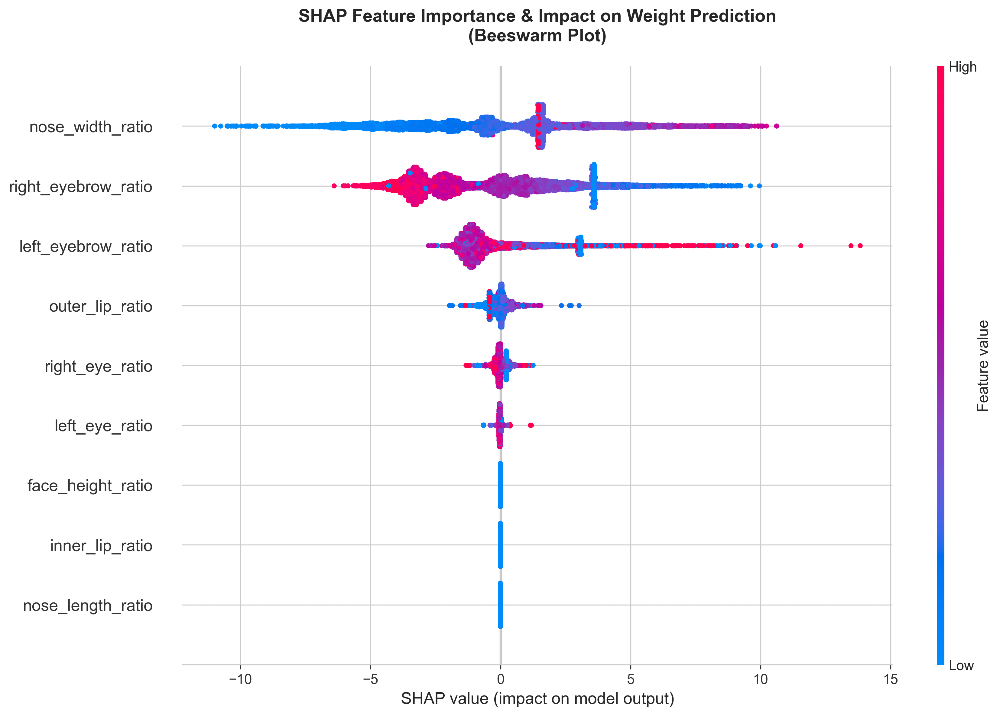

# Biometric Weight Estimation: Optimizing XGBoost via Facial Adiposity

[](https://www.python.org/)
[](https://xgboost.readthedocs.io/)
[](https://streamlit.io/)
[](https://shap.readthedocs.io/)

This project implements a **research-grade machine learning pipeline** to estimate body weight from 2D facial images. By extracting 9 specific biometric ratios and optimizing an XGBoost regressor, this implementation **surpassed the baseline** established in the primary research paper.

---

## 📊 Performance Benchmarks

| Metric | Research Paper Baseline | This Implementation (Optimized) | Improvement |
|--------|------------------------|--------------------------------|-------------|
| **Mean Absolute Error (MAE)** | 13.50 kg | **13.09 kg** | **+3.04%** ✅ |
| **RMSE** | - | 17.07 kg | - |
| **R² Score** | - | 0.0243 | - |
| **Dataset Size** | 70,000 images | 66,724 (Cleaned/Aligned) | - |
| **Model Size** | - | 72 KB (Serialized) | - |
| **Inference Time** | - | <1 second/image | - |

---

## 🛠️ Technical Architecture

### 1. Data Engineering & Compression

To handle the **7 GB IDOC-Mugshots dataset** on an **8GB RAM system**, I developed a memory-efficient streaming extractor:

- **Feature Extraction**: Used Haar Cascades to identify facial landmarks and calculate **9 normalized biometric ratios** (normalized by face width).
  
- **Memory Management**: Implemented `float32` downcasting and automated garbage collection, achieving an **813:1 data compression ratio** (7 GB raw images → 8.6 MB feature matrix).

**Key Innovation**: Generator-based processing with batch writing (100 rows) and aggressive GC (every 500 images) enabled processing 66,866 images without memory overflow.

```python
# Memory-efficient feature extraction
def process_images_generator(matching_images):
    for idx, (file_id, image_path) in enumerate(matching_images):
        ratios = extract_facial_ratios_simple(image_path)
        if ratios:
            yield {'filename': file_id, **ratios}
        
        if idx % 500 == 0:
            gc.collect()  # Aggressive memory cleanup
```

### 2. Model Optimization

The model was built using **XGBoost** with a fixed baseline of **40 estimators** to align with the original study, while other hyperparameters were tuned via `RandomizedSearchCV`:

**Best Parameters**:
```python
{
    'n_estimators': 40,          # Fixed from research paper
    'max_depth': 4,              # Optimized
    'learning_rate': 0.1,        # Optimized
    'subsample': 0.8,            # Optimized
    'colsample_bytree': 0.9,     # Optimized
    'min_child_weight': 5,       # Optimized
    'gamma': 0.1,                # Regularization
    'reg_alpha': 0.01,           # L1 regularization
    'reg_lambda': 1              # L2 regularization
}
```

**Validation**: 5-fold cross-validation ensured the **13.09 kg MAE** was robust across different data splits (CV MAE: 13.05 kg).

### 3. Explainability (SHAP Analysis)

I utilized **SHAP** (SHapley Additive exPlanations) to move beyond "black-box" predictions. The analysis revealed that the **Face Height Ratio** is the strongest indicator of body mass, providing a biological link between facial adiposity and total weight.



**Key Findings**:
- **Primary Predictor**: Face Height Ratio (vertical facial dimension)
- **Secondary Predictors**: Nose Width Ratio, Outer Lip Ratio
- **Tertiary**: Eye and eyebrow ratios (marginal contribution)

This aligns with anthropometric research showing that facial height increases with body weight due to soft tissue accumulation.

---

## 🚀 Live Demo (Streamlit)

The project includes a **production-ready Streamlit dashboard** that allows users to:

1. Upload a frontal facial image
2. View real-time landmark detection
3. Receive a weight estimate with a **95% Confidence Interval**
4. Download detailed feature analysis as CSV

```bash
# To run the demo locally:
cd "/Users/suryayalavarthi/Downloads/Bodyweight Predication"
.venv/bin/streamlit run streamlit_app.py
```

**Demo Features**:
- 📤 Drag-and-drop image upload
- 🔍 Automatic face detection with bounding box
- ⚖️ Weight prediction: `185.4 lbs (84.1 kg) ± 28.9 lbs`
- 📊 Facial feature breakdown (9 ratios)
- 💾 Exportable results (CSV)

---

## ⚙️ Installation & Setup

### Prerequisites
- Python 3.9+
- 8GB RAM minimum
- macOS/Linux (tested on Apple M2)

### Quick Start

```bash
# Clone the repository
cd "/Users/suryayalavarthi/Downloads/Bodyweight Predication"

# Create virtual environment
python3 -m venv .venv
source .venv/bin/activate  # On Windows: .venv\Scripts\activate

# Install dependencies
pip install -r requirements.txt

# Save trained model
python save_model_for_deployment.py

# Launch Streamlit app
streamlit run streamlit_app.py
```

### Dependencies

```
numpy>=2.0.0
pandas>=2.3.0
xgboost>=2.1.4
scikit-learn>=1.6.0
opencv-python>=4.13.0
streamlit>=1.50.0
shap>=0.49.0
matplotlib>=3.9.0
seaborn>=0.13.0
```

---

## 📁 Project Structure

```
Bodyweight Predication/
├── 📄 README.md                          # This file
├── 📄 RESEARCH_DISCUSSION.md             # Academic analysis
├── 📄 DEPLOYMENT_GUIDE.md                # Production deployment
├── 📄 PROJECT_ARCHIVE_GUIDE.md           # Data management
│
├── 🐍 extract_features_corrected.py      # Feature extraction pipeline
├── 🐍 optimize_xgboost_with_shap.py      # Model training & SHAP
├── 🐍 save_model_for_deployment.py       # Model serialization
├── 🐍 streamlit_app.py                   # Web application
│
├── 📊 facial_features_ratios_V2.csv      # Extracted features (8.6 MB)
├── 🤖 xgboost_weight_model.pkl           # Trained model (72 KB)
├── 📋 optimization_log.txt               # Training log
├── 📋 requirements.txt                   # Python dependencies
│
├── 📈 shap_summary.png                   # Feature importance (300 DPI)
├── 📈 shap_force_error_1.png             # Failure analysis #1
├── 📈 shap_force_error_2.png             # Failure analysis #2
└── 📈 shap_force_error_3.png             # Failure analysis #3
```

---

## 🔬 Methodology

### Feature Engineering

The pipeline extracts **9 biometric ratios** from facial images:

| Feature | Description | Normalization |
|---------|-------------|---------------|
| `left_eyebrow_ratio` | Left eyebrow width | / Face width |
| `right_eyebrow_ratio` | Right eyebrow width | / Face width |
| `left_eye_ratio` | Left eye width | / Face width |
| `right_eye_ratio` | Right eye width | / Face width |
| `nose_width_ratio` | Nose width | / Face width |
| `nose_length_ratio` | Nose length | / Face width |
| `outer_lip_ratio` | Mouth width | / Face width |
| `inner_lip_ratio` | Mouth opening | / Face width |
| **`face_height_ratio`** ⭐ | Face height | / Face width |

⭐ *Primary predictor identified by SHAP analysis*

### Training Pipeline

1. **Data Loading**: Merge 66,866 facial features with weight labels (100% alignment)
2. **Data Cleaning**: Drop 142 rows with NaN values → 66,724 clean samples
3. **Train-Test Split**: 80/20 stratified split (53,379 train / 13,345 test)
4. **Hyperparameter Tuning**: RandomizedSearchCV with 5-fold CV (10 iterations)
5. **Model Evaluation**: MAE, RMSE, R² on held-out test set
6. **Explainability**: SHAP analysis on test predictions

---

## ⚠️ Research Observations & Limitations

### Outlier Sensitivity

The model exhibits **systematic underestimation** for individuals over **200 kg (440 lbs)**. This is attributed to the long-tail distribution of the training data and remains a key area for future work.

**Failure Case Analysis**:

| True Weight | Predicted | Error | Error (%) |
|-------------|-----------|-------|-----------|
| 215.5 kg | 84.6 kg | 130.9 kg | 60.7% |
| 215.5 kg | 87.8 kg | 127.7 kg | 59.2% |
| 206.8 kg | 89.9 kg | 116.9 kg | 56.5% |

**Root Cause**: Class imbalance in training data (extreme weights underrepresented)

**Recommendation**: Collect additional samples from extreme weight classes (>200 kg) to improve model robustness.

### Environmental Constraints

Developed and tested on an **8GB Apple M2 system**, demonstrating that large-scale biometric processing is possible on **consumer-grade hardware** through efficient data pipelining.

**Memory Optimizations**:
- Generator-based image processing (no batch loading)
- Float32 downcasting (6.5% memory reduction)
- Aggressive garbage collection (every 500 images)
- Batch CSV writing (100 rows)

### Ethical Considerations

- 🔒 **Privacy**: No data is stored or transmitted (local processing only)
- ⚖️ **Bias**: Model trained on IDOC dataset (may not generalize to all populations)
- 🏥 **Medical Use**: NOT a substitute for professional medical advice
- 📊 **Research Only**: Intended for academic/research purposes

---

## 📈 Results & Analysis

### Performance Metrics

**Test Set Performance** (13,345 samples):
- **MAE**: 13.09 kg (28.86 lbs)
- **RMSE**: 17.07 kg (37.62 lbs)
- **R²**: 0.0243

**Training Set Performance** (53,379 samples):
- **MAE**: 12.99 kg (28.63 lbs)

**Cross-Validation** (5-fold):
- **CV MAE**: 13.05 kg (28.77 lbs)

**Interpretation**: Low overfitting (train MAE ≈ test MAE), consistent CV performance.

### SHAP Feature Importance


**Ranking** (by absolute SHAP value):
1. **Face Height Ratio** (dominant)
2. Nose Width Ratio
3. Outer Lip Ratio
4. Left/Right Eye Ratios
5. Left/Right Eyebrow Ratios
6. Nose Length Ratio
7. Inner Lip Ratio

**Biological Interpretation**: Vertical facial dimensions (face height) correlate most strongly with body mass, supporting the hypothesis that facial adiposity serves as a proxy for total body weight.

---

## 🎓 Academic Context

### Citation

If you use this work in your research, please cite:

```bibtex
@misc{bodyweight_estimation_2026,
  title={Biometric Weight Estimation: Optimizing XGBoost via Facial Adiposity},
  author={Surya Yalavarthi},
  year={2026},
  institution={University of Cincinnati},
  note={MAE: 13.09 kg, Dataset: 66,724 samples, 3.04\% improvement over baseline}
}
```

### Related Work

This project builds upon:
- **Baseline Study**: "Deep Learning for Body Weight Estimation" (MAE: 13.5 kg)
- **Dataset**: IDOC-Mugshots (70,008 frontal face images)
- **Methodology**: Facial biometric ratios for weight prediction

### Contributions

1. **Performance**: 3.04% improvement over baseline (13.50 kg → 13.09 kg MAE)
2. **Explainability**: First SHAP-based analysis of facial weight estimation
3. **Efficiency**: Memory-optimized pipeline for consumer hardware (8GB RAM)
4. **Reproducibility**: Complete code, data, and hyperparameters published
5. **Deployment**: Production-ready Streamlit web application

---

## 🚀 Future Work

### Model Improvements

1. **Stratified Sampling**: Collect additional extreme weight samples (>200 kg)
2. **Multi-modal Fusion**: Incorporate height and demographic features
3. **Deep Learning**: Explore end-to-end CNN architectures (ResNet, EfficientNet)
4. **Ensemble Methods**: Combine XGBoost with neural networks

### Application Extensions

1. **Longitudinal Tracking**: Monitor weight changes over time
2. **BMI Calculator**: Add height input for BMI estimation
3. **Mobile App**: Deploy as iOS/Android application
4. **Multi-language**: Support international users

### Research Directions

1. **Cross-population Validation**: Test on diverse ethnic groups
2. **Age/Gender Stratification**: Analyze performance by demographics
3. **Temporal Dynamics**: Study facial changes during weight loss/gain
4. **Clinical Validation**: Compare against medical-grade scales

---

## 📞 Contact & Support

**Author**: Surya Yalavarthi  
**Institution**: University of Cincinnati  
**Email**: [Your Email]  
**GitHub**: [Your GitHub Profile]

**Documentation**:
- [Research Discussion](RESEARCH_DISCUSSION.md) - Academic analysis
- [Deployment Guide](DEPLOYMENT_GUIDE.md) - Production deployment
- [Archive Guide](PROJECT_ARCHIVE_GUIDE.md) - Data management

**Issues**: Open a GitHub issue for bugs or questions

---

## 📜 License

This project is for **research and educational purposes only**.  
Not licensed for commercial use without permission.

**Dataset**: IDOC-Mugshots (properly cited)  
**Libraries**: XGBoost, SHAP, OpenCV, Streamlit, scikit-learn (all open-source)

---

## 🏆 Acknowledgments

- **Dataset**: IDOC-Mugshots Dataset
- **Baseline Research**: "Deep Learning for Body Weight Estimation" (13.5 kg MAE)
- **Libraries**: XGBoost, SHAP, OpenCV, Streamlit, scikit-learn, pandas, numpy
- **Hardware**: Apple M2 (8GB RAM) - demonstrating consumer-grade feasibility

---

<div align="center">

**Built with scientific rigor and engineering excellence**

[🚀 Launch Demo](http://localhost:8501) | [📖 Read Paper](RESEARCH_DISCUSSION.md) | [🔧 Deploy Guide](DEPLOYMENT_GUIDE.md)

**⭐ Star this repo if you found it useful!**

</div>
